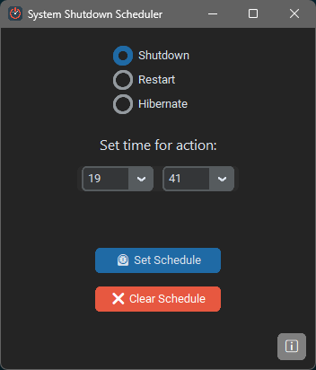

# 📴 Shutdown Scheduler

A minimal and modern desktop application to schedule **Shutdown**, **Restart**, or **Hibernate** operations at a specified time on Windows and Linux.

  

---

## 🖼️ Screenshot



---

## 🚀 Features

- Simple and clean UI using [CustomTkinter](https://github.com/TomSchimansky/CustomTkinter)
- Select between **Shutdown**, **Restart**, or **Hibernate**
- Time picker for hour and minute
- Cross-platform support (Windows/Linux)
- Clear any scheduled operation
- Smooth hover effects
- GitHub link built-in

---

## 🛠 How to use

1. Run the app (You can download the `.exe` file from the [releases](https://github.com/MehdiSlr/Shutdown-Scheduler/releases))
2. Select the operation you want to schedule
3. Select the time
4. Click on the button to schedule the operation

---

## 📝 Requirements

- [Python 3.8+](https://www.python.org/)
- [CustomTkinter](https://github.com/TomSchimansky/CustomTkinter)
- [PyInstaller](https://pyinstaller.org/)
- [pillow](https://pillow.readthedocs.io/en/stable/)

---


## 📦 Installation

> Make sure Python 3.8+ is installed.

Install the required packages:

```python  
pip install -r requirements.txt  
```

Run the app:

```python  
python main.py  
```

---

## 🛠 Build Executable

Use [PyInstaller](https://pyinstaller.org/) to create an executable file:

### Windows


```bash  
pyinstaller --onefile --noconsole --hidden-import=pillow --hidden-import=customtkinter --windowed --add-data "assets/icon.ico;assets" --icon=assets/icon.ico main.py
```

### Linux

```bash
pyinstaller --onefile --noconsole --hidden-import=customtkinter --windowed --add-data "assets:assets" --icon=assets/icon.ico main.py
```

---

## 📁 Folder Structure

```css
Shutdown-Scheduler/
├── main.py
├── assets/ 
│   ├── icon.ico 
│   └── screenshot.png 
├── requirements.txt 
├── README.md
├── LICENSE
└── .gitignore

```
---

## 📝 License

This project is licensed under the [MIT License](LICENSE).

---

## 🔗 GitHub

View source and updates on  
👉 **[github.com/MehdiSlr/Shutdown-Scheduler](https://github.com/MehdiSlr/Shutdown-Scheduler)**

